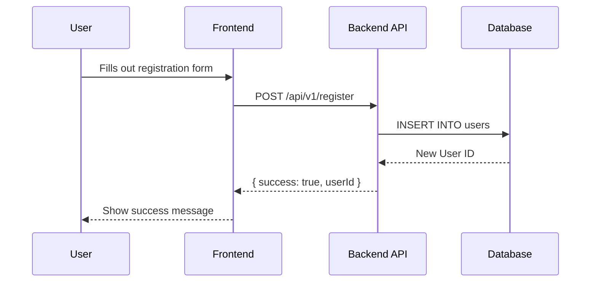

# PR Summary: $title

## 📜 High-Level Summary

<!-- Insert the concise, high-level summary (max 150 words) here. -->

## 📊 Architectural Impact & Visualizations

<!--
  - Insert Mermaid diagram(s) here, if applicable.
  - Use fenced code blocks with the `mermaid` identifier.
  - Precede each diagram with a brief explanation.
  - If no diagram is needed, this entire section can be omitted.
-->

**Example:**
This diagram illustrates the new data flow for user registration.

## ⚙️ Detailed Changeset Breakdown

---

### Changeset 1: [Meaningful Title for the First Group of Changes]

**Files Affected:**

- `path/to/file1.go`
- `path/to/another/file.go`

**Summary of Changes:**

- <!-- Bulleted list explaining the specific changes in this changeset. -->
- <!-- Remember to note any changes to public APIs, function signatures, or global state. -->

**[TRIAGE]:** <NEEDS_REVIEW or APPROVED>
